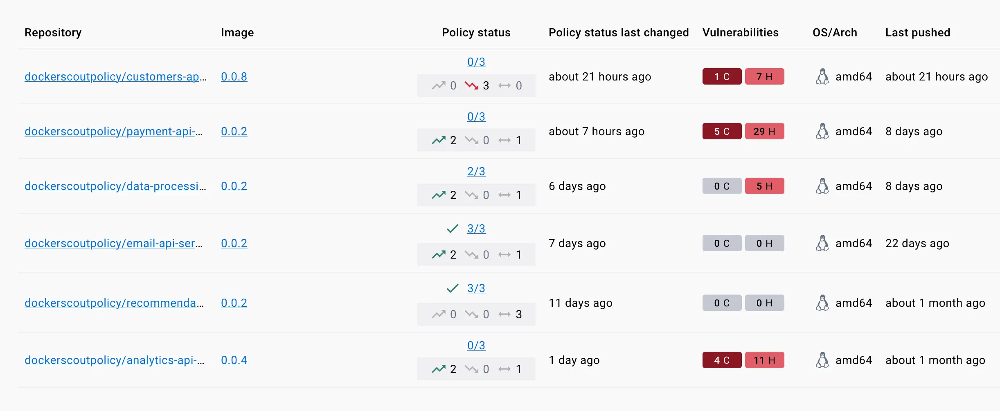
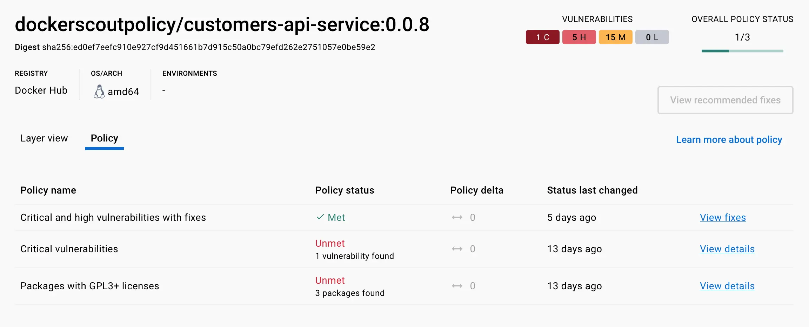

你可以在 [Docker Scout 仪表板](#dashboard) 中，或通过[命令行](#cli)，
跟踪各制品（artifact）的策略状态。

## 仪表板 {#dashboard}

[Docker Scout Dashboard](https://scout.docker.com/) 的 **Overview** 页签
展示了各仓库近期策略变化的概要。
该摘要会对比最新镜像与上一个版本的策略评估结果，突出变化最大的镜像。


### 按仓库查看策略状态

在所选环境中，**Images** 页签显示所有镜像的当前策略状态与近期趋势。
列表中的 **Policy status** 列展示：

- 已满足策略的数量/策略总数
- 近期策略趋势



列表中的方向箭头用于表示与同环境下的上一版本相比，
该镜像的策略状况是变好、变差，还是保持不变：

- 绿色上箭头：在最新推送的镜像中，变好的策略数量。
- 红色下箭头：在最新推送的镜像中，变差的策略数量。
- 灰色双向箭头：在最新版本中，保持不变的策略数量。

选中某个仓库后，可打开 **Policy** 页签，查看最新分析的镜像与其上一个版本之间的策略差异详情。

### 详细结果与修复建议

要查看某个镜像的完整评估结果，请在 Dashboard 中进入该镜像标签的详情页，打开 **Policy** 页签。
此处会列出当前镜像涉及的所有策略违规项的明细。


该视图还会给出改进策略状态的建议与指引。



对于与漏洞相关的策略，若存在可用的修复版本，策略详情会显示对应的修复版本。
要修复问题，请将相关软件包升级到该修复版本。

对于与许可证合规相关的策略，列表会显示不满足策略条件的所有软件包。
要修复问题，可尝试移除对该软件包的依赖，或寻找使用更合适许可证分发的替代包。

## CLI {#cli}

要在命令行中查看镜像的策略状态，使用 `docker scout policy` 命令：

```console
$ docker scout policy \
  --org dockerscoutpolicy \
  --platform linux/amd64 \
  dockerscoutpolicy/email-api-service:0.0.2

    ✓ Pulled
    ✓ Policy evaluation results found


​## Overview
​
​             │               Analyzed Image
​─────────────┼──────────────────────────────────────────────
​  Target     │  dockerscoutpolicy/email-api-service:0.0.2
​    digest   │  17b1fde0329c
​    platform │ linux/amd64
​
​
​## Policies
​
​Policy status  FAILED  (2/8 policies met, 3 missing data)
​
​  Status │                  Policy                             │           Results
​─────────┼─────────────────────────────────────────────────────┼──────────────────────────────
​  ✓      │ No copyleft licenses                                │    0 packages
​  !      │ Default non-root user                               │
​  !      │ No fixable critical or high vulnerabilities         │    2C     1H     0M     0L
​  ✓      │ No high-profile vulnerabilities                     │    0C     0H     0M     0L
​  ?      │ No outdated base images                             │    No data
​         │                                                     │    Learn more ↗
​  ?      │ SonarQube quality gates passed                      │    No data
​         │                                                     │    Learn more ↗
​  !      │ Supply chain attestations                           │    2 deviations
​  ?      │ No unapproved base images                           │    No data

...
```

关于该命令的更多信息，请参阅[CLI 参考](/reference/cli/docker/scout/policy.md)。
